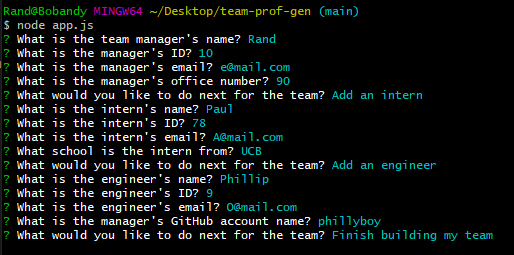
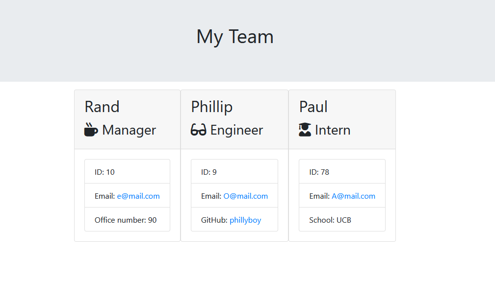

# Team Profile Generator

## Description
This Javascript application runs in Node.js to generate a team profile composed of a manager and as many team members as they would like to add. Upon running the app, a series of questions is presented to glean information about the manager, and then the user can sequentially add engineers and/or interns to their heart's content. Once the team is complete, the user can select "Finish building my team" to generate presentable HTML that visualizes the team based on information provided by the user. The HTML is written to the /output directory for the user to see, use, and modify.

A video of the application in action is included [here](https://drive.google.com/file/d/1JGok13v8YFiAp_IEp6iGmpZVeDbpR5ol/view) and can also be accessed via link in the [Screenshots](#screenshots) section further in this document.

## Table of Contents
* [Technologies Used](#technologies-used)
* [How to Access](#how-to-access)
* [What I Did](#what-i-did)
* [Code Snippets](#code-snippets)
* [Screenshots](#screenshots)
* [Acknowledgments](#acknowledgments*)
* [Who I Am](#who-i-am)

---

## Technologies Used
* [Javascript](https://www.javascript.com/) to develop the algorithms included in this web application.
* [Node.js](https://nodejs.org/en/docs/) to run this Javascript program in the terminal/Git Bash console.
* [Git](https://git-scm.com/) for distributed version control, tracking changes over time and making them visible to collaborators.
* [Github](https://github.com/) for version control in the cloud, saving my changes and presenting them clearly to myself and others.

## How to Access
1. Download the contents of this repository to your local machine. 
2. Using the terminal/Git Bash Navigate to the directory containing the contents of this repository, named team-prof-gen by default.
3. Run the command `npm install` in the terminal to install the **inquirer** node package module dependency.
4. Run the command `node app.js` in the terminal to launch the program.
5. Enter your responses as prompted in the terminal, and your team.html file will be written for you using your responses. The file will be located in the team-prof-gen/output directory.

---

## What I Did
This Javascript application utilizes a series of callback functions and object classes to construct objects matching the user's choice of employee-type. It then inserts those objects into an HTML page built from templates with values specific to the user-input provided in the command line. The app starts when `node app.js` is run, prompts the user with questions to help them build their team page. 

## Code Snippets 
The following function nextOne() is called just after the user finishes answering their questions to fill out the Manager object. Depending on the user's choice here, nextOne() calls either engAsk() or intAsk() to ask the suite of questions belonging to those functions. In either case, nextOne() is called again immediately after engAsk() or intAsk() concludes. If the user chooses the third option to "Finish building my team" then the function concludes and allows the greater function that called it to continue to render(allTeam), generating the HTML that will be written to `team.html`.

```javascript
const nextOne = async function(allTeam) {
    const next1 = await inquirer.prompt({
        type: "list",
        message: "What would you like to do next for the team?",
        choices: ["Add an engineer", "Add an intern", "Finish building my team"],
        name: "nextChoice"
    });
    if (next1.nextChoice === 'Add an engineer') {
        await engAsk(allTeam);
        await nextOne(allTeam)
    } else if (next1.nextChoice === 'Add an intern') {
        await intAsk(allTeam);
        await nextOne(allTeam);
    }
}
```

## Screenshots
Example of app running in the command line:



Example HTML generated from above responses:



[Click here](https://drive.google.com/file/d/1JGok13v8YFiAp_IEp6iGmpZVeDbpR5ol/view) to see a short video demonstrating usage of the application.

---

## Acknowledgments
* [W3Schools](https://www.w3schools.com/) has been my go-to for descriptive tutorials on HTML, CSS, and Javascript syntax and best practices. I am eternally grateful for their massive store of documentation.
* [MDN Web Docs](https://developer.mozilla.org/en-US/) is another resource for documentation on HTML, CSS, and Javascript that I find myself using more and more often as I work through deeper Javascript.
* [Inquirer](https://www.npmjs.com/package/inquirer) is an open source node package that I used to provide interactive command line prompts in this project.


## Who I Am
My name is Rand Hale, and I am an aspiring programmer/web developer based in California.

* [LinkedIn](https://www.linkedin.com/in/rand-hale-83ba389b/)
* [GitHub](https://github.com/prophetrand)